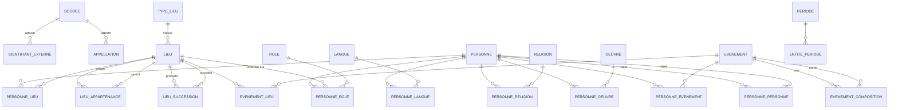

# Coeval — modèle de données

> Écrit le 2026-09-18, à partir de la base Access `MainBdd` (tables Lieu,
> Type de Lieu, Origines, Personnage) fournie en exemple. **Le modèle est
> neutre** : il se pose aussi bien dans Access, SQLite, PostgreSQL ou un
> fichier JSON. Aucun type propre à un moteur n'est utilisé.
>
> Destination : la base finale de Coeval, celle que l'application lira.

## 1. Les cinq règles qui commandent tout le reste

### R1 — Une date est un nombre et une précision, jamais un type « date »

Le type Date des moteurs courants ne descend pas avant l'an 100 et ne sait pas
dire « vers 1450 ». Or l'application accepte des années jusqu'à -300 000, et
Wikidata livre des dates à la décennie ou au siècle.

Partout où une date apparaît, ce sont donc **deux colonnes** :

| Colonne | Contenu |
|---|---|
| `…_annee` | entier signé. `-52` = 52 av. J.-C. Pas d'année zéro : -1 précède 1. |
| `…_precision` | 11 = jour, 10 = mois, 9 = année, 8 = décennie, 7 = siècle, 6 = millénaire |

Les codes sont ceux de Wikidata, repris tels quels pour que l'import n'ait
rien à traduire. Deux colonnes facultatives, `…_mois` et `…_jour`, gardent le
détail quand la précision vaut 10 ou 11.

### R2 — Tout fait porte sa source et sa date de relevé

Pas « Napoléon est né en 1769 », mais « Wikidata, relevé le 18/09/2026, dit que
Napoléon est né en 1769 ». Trois colonnes sur **chaque** table de lien :

| Colonne | Contenu |
|---|---|
| `source_id` | qui l'affirme |
| `releve_le` | quand nous l'avons lu |
| `retenu` | 1 si c'est cette version que l'application affiche |

Sans ces colonnes, brancher une deuxième source est impossible : on ne sait
plus qui a dit quoi, ni lequel des deux est le plus récent.

### R3 — Deux sources qui se contredisent cohabitent, elles ne s'écrasent pas

**Ce n'est pas une hypothèse : c'est mesuré sur ce projet.** Laplace porte deux
dates de mort à un jour d'écart *à l'intérieur de Wikidata seul*. 400 lignes de
réponse ne font que 227 personnes, parce que chacune porte plusieurs valeurs
concurrentes.

Le modèle accepte donc **plusieurs lignes pour le même fait**, une par source.
La colonne `retenu` dit laquelle gagne. **L'arbitrage est du code, pas du
schéma** : la règle actuelle garde la plus précise, puis la plus ancienne à
précision égale.

### R4 — Le pivot entre les sources est la table des identifiants externes

Chaque entité a un numéro **local**, qui n'a de sens que chez nous. Les
identifiants des référentiels (Wikidata `Q517`, VIAF, Pleiades, PeriodO) vivent
dans une table à part, à raison d'autant de lignes que nécessaire.

C'est ce qui permet de dire « notre lieu n° 2 et le `Q142` de Wikidata sont le
même » sans jamais confondre les deux numérotations.

### R4 bis — Chaque table porte une `description` en texte libre

**Toutes** les tables — entités, liens, transverses — ont une colonne
`description`, du texte libre sans longueur imposée. Elle dit ce que les
colonnes structurées ne savent pas dire : une nuance, une réserve, la raison
d'un choix.

Sur une table de lien, elle vaut souvent plus que sur une entité : « il y
séjourne après son exil, sans jamais y résider officiellement » n'entre dans
aucune colonne, et c'est pourtant l'essentiel.

**Trois règles pour qu'elle reste utile plutôt que de devenir un fourre-tout :**

1. **Elle ne remplace jamais une colonne.** Une date écrite dans la
   description est une date perdue : rien ne la cherchera. Si une information
   revient souvent en texte libre, c'est le signe qu'il manque une colonne.
2. **On sait toujours qui l'a écrite.** La ligne porte déjà `source_id` : une
   description venue de Wikidata et une note personnelle ne se confondent pas.
3. **Attention à la licence.** Recopier un résumé de Wikipédia y fait entrer
   une licence CC BY-SA, qui impose d'attribuer et de partager à l'identique —
   alors que Wikidata est en CC0, sans obligation. **Ne pas mélanger les deux
   sans le noter dans `source`.**

### R5 — Un lien entre deux choses est presque toujours daté

L'Alsace a été française, puis allemande, puis française. Une colonne `Parent`
ne peut pas raconter cela. Presque tous les liens de ce modèle portent donc un
début et une fin, avec leurs précisions.

## 2. Le diagramme

Les tables `IDENTIFIANT_EXTERNE` et `APPELLATION` se rattachent à **n'importe
quelle** entité par un couple (type d'entité, numéro). C'est le seul endroit où
le modèle renonce à une clé étrangère stricte, et c'est assumé : sans cela il
faudrait dupliquer ces deux tables neuf fois.

## 3. Les tables d'entités

Chacune porte au minimum : `id`, `nom` (la forme d'usage en français),
`description`, `source_id`, `releve_le`.

| Table | Ce qu'elle contient | Colonnes propres |
|---|---|---|
| `personne` | Un être humain | `sexe` (facultatif, pour mesurer le déséquilibre, pas pour l'imposer) |
| `lieu` | Une entité géographique ou politique, du continent à l'adresse | `type_lieu_id`, `creation_annee`, `creation_precision`, `fin_annee`, `fin_precision`, `latitude`, `longitude`, `adresse_texte` |
| `type_lieu` | Du continent à l'adresse — voir § 3 bis | `rang` (du plus large au plus étroit) |
| `evenement` | Ce qui arrive : bataille, traité, révolution, sacre | `type_evenement`, `debut_*`, `fin_*`, `ponctuel` (vrai si un instant) |
| `oeuvre` | Un livre, un tableau, une symphonie, un traité | `type_oeuvre`, `creation_*` |
| `langue` | Une langue | `code_iso` (facultatif) |
| `religion` | Une religion ou un courant | `religion_parent_id` (le luthéranisme sous le christianisme) |
| `role` | Ce qu'on **est** ou ce qu'on **occupe** | `nature` : `metier` (philosophe) ou `fonction` (roi de France) |
| `periode` | Une époque nommée : Renaissance, Néolithique | `debut_*`, `fin_*`, `portee_lieu_id` |

### 3 bis — L'échelle des lieux descend jusqu'à l'adresse

`type_lieu` porte un `rang`, du plus large au plus étroit. Une seule table
`lieu` couvre toute l'échelle, chaque niveau étant rattaché au précédent par
`lieu_appartenance` — datée, comme tout le reste.

| Rang | Type | Exemple |
|---:|---|---|
| 10 | continent | Europe |
| 20 | ensemble politique | Saint-Empire romain germanique |
| 30 | pays / État | France, Gaule |
| 40 | région | Alsace |
| 50 | ville | Paris |
| 60 | quartier | Le Marais |
| 70 | **adresse** | 12 rue de Rivoli |

**Une adresse est un lieu comme un autre**, de type `adresse` : son `nom` porte
le texte tel qu'on l'écrit, et `lieu_appartenance` la rattache à son quartier
ou à sa ville. La colonne `adresse_texte` garde la forme brute quand elle
diffère du nom d'usage.

**Ce que cette échelle rend possible, et qu'une hiérarchie figée interdirait :**
une adresse peut être rattachée directement à une ville quand le quartier est
inconnu. Les rangs servent à ordonner l'affichage, pas à imposer un chemin
complet.

**Pourquoi `role` réunit métier et fonction.** « Philosophe » et « roi de
France » se posent tous deux sur une personne pendant un intervalle. Les
séparer en deux tables obligerait à écrire deux fois chaque requête. La colonne
`nature` suffit à les distinguer — et c'est elle qui dit si la ligne doit
porter un lieu.

## 4. Les tables de lien

Toutes portent : `id`, `debut_annee`, `debut_precision`, `fin_annee`,
`fin_precision`, `description`, `source_id`, `releve_le`, `retenu`.

| Table | Relie | Colonne qui précise la nature du lien |
|---|---|---|
| `personne_lieu` | personne ↔ lieu | `nature` : `naissance`, `mort`, `residence`, `sejour`, `exil`, `sepulture`, `citoyennete`, `ascendance` — voir § 4 bis |
| `personne_role` | personne ↔ rôle | `lieu_id` facultatif — « roi **de France** » |
| `personne_langue` | personne ↔ langue | `nature` : `maternelle`, `ecrit`, `parle` |
| `personne_religion` | personne ↔ religion | `nature` : `pratique`, `conversion`, `abjuration` |
| `personne_oeuvre` | personne ↔ œuvre | `nature` : `auteur`, `traducteur`, `commanditaire`, `sujet` |
| `personne_evenement` | personne ↔ événement | `nature` : `participant`, `vainqueur`, `victime`, `signataire` |
| `evenement_lieu` | événement ↔ lieu | `nature` : `deroulement`, `signature` |
| `evenement_composition` | événement ↔ événement | Austerlitz **fait partie de** la guerre de la Troisième Coalition |
| `lieu_appartenance` | lieu ↔ lieu | **Remplace la colonne `Parent`.** Datée : l'Alsace change de parent |
| `lieu_succession` | lieu ↔ lieu | `nature` : `succede`, `scission`, `fusion`, `renommage` |
| `personne_personne` | personne ↔ personne | `nature` : `parent`, `conjoint`, `fratrie`, `maitre`, `eleve`, `allie`, `adversaire` |
| `entite_periode` | n'importe quelle entité ↔ période | rattache une vie, une œuvre, un lieu à une époque nommée |

### 4 bis — Le parcours d'une personne dans l'espace et le temps

`personne_lieu` porte déjà un début et une fin, comme toutes les tables de
lien. **Une vie entière s'y écrit donc ligne par ligne**, chacune avec son
lieu, ses dates et sa nature :

| nature | dates | lieu | description |
|---|---|---|---|
| `naissance` | 1769, jour | Ajaccio | |
| `residence` | 1779 → 1785 | Brienne-le-Château | école militaire |
| `sejour` | 1798 → 1799 | Égypte | campagne |
| `residence` | 1804 → 1814 | Paris | |
| `exil` | 1815 → 1821 | Sainte-Hélène | |
| `mort` | 1821, jour | Sainte-Hélène | |

**Trié par date, cela donne l'itinéraire.** C'est ce qui permettra plus tard de
répondre à « où était-il en 1800 ? » — la question dont dépend le calcul de
l'origine d'une œuvre — et de tracer un déplacement sur une carte, le jour où
il y en aura une.

**Trois natures distinguées, parce qu'elles ne disent pas la même chose :**

- `residence` — il y habite. C'est là qu'il faut chercher son adresse.
- `sejour` — il y passe, sans s'y installer : une campagne, un voyage, un
  congrès. Confondre les deux ferait de tout voyageur un habitant.
- `exil` — il y est contraint. C'est une résidence, mais subie, et la nuance
  compte assez souvent en histoire pour mériter son mot.

**Les dates manquantes ne se comblent pas.** Une résidence sans date de fin
signifie « on ne sait pas quand il est parti », **jamais** « il y est resté
jusqu'à sa mort ». C'est la même règle que pour les règnes, où la traiter à
l'envers avait fait entrer un souverain de 2599 av. J.-C. dans une fenêtre du
XVIIIe siècle.

### La table entre personnes porte un sens de lecture

`personne_personne` a un `sujet_id` et un `objet_id`, et le sens compte :
`nature = parent` se lit **« sujet est le parent de objet »**. Une seule ligne
suffit ; l'inverse (« objet est l'enfant de sujet ») se déduit et n'est jamais
stocké — deux lignes pour un même fait finissent toujours par diverger.

Ce qu'elle ouvre : les dynasties, les écoles de pensée, les alliances. Ce
qu'elle exige : les dates, comme partout. Un mariage a un début et souvent une
fin ; un lien de filiation n'en a pas.

### La naissance et la mort ne sont pas des colonnes de `personne`

Elles sont des lignes de `personne_lieu`, avec `nature = naissance` ou `mort`.

**Trois raisons :**
1. cela dit d'un coup **quand** et **où**, sans dupliquer les colonnes ;
2. deux sources qui se contredisent tiennent côte à côte (règle R3) ;
3. une naissance dont on ignore le lieu s'écrit avec `lieu_id` vide, sans
   rendre la date inutilisable.

**Le prix à payer :** la question la plus courante de l'application — « qui
vivait entre telle et telle année ? » — demande une jointure. On le paie une
fois, avec une **vue** `personne_vie` qui expose `personne_id`,
`naissance_annee`, `naissance_precision`, `mort_annee`, `mort_precision`, en ne
gardant que les lignes `retenu = 1`.

### L'origine d'une œuvre se déduit, elle ne se stocke pas

**Décision prise le 2026-09-18 :** une œuvre n'a pas ses propres liens vers des
lieux. Son origine se calcule : on prend sa date de création, on regarde où son
auteur se trouvait à cette date dans `personne_lieu`, et c'est là que l'œuvre
est née.

**Ce qui est gagné :** aucune donnée en double, donc aucune contradiction
possible entre le lieu de l'œuvre et celui de son auteur.

**Ce qu'il faut assumer, et dire à l'écran :** ce calcul échouera souvent.

| Cas | Ce que l'application doit afficher |
|---|---|
| L'auteur est à deux endroits à cette date | les deux, ou « indéterminé » — jamais un seul choisi au hasard |
| La date de création est imprécise (« vers 1650 ») | la résidence de la période, avec la mention de l'imprécision |
| Aucune résidence connue à cette date | **« indéterminé »**, pas le dernier lieu connu |
| Plusieurs auteurs | autant d'origines possibles |

La règle du projet s'applique ici comme ailleurs : **ce qui manque s'affiche,
il ne se devine pas.**

## 5. Les tables transverses

| Table | Colonnes | Rôle |
|---|---|---|
| `source` | `id`, `nom`, `url`, `licence`, `consultee_le`, `description` | Wikidata, PeriodO, saisie manuelle… |
| `identifiant_externe` | `id`, `entite_type`, `entite_id`, `referentiel`, `code`, `source_id`, `description` | Le pivot entre nos numéros et ceux du monde extérieur |
| `appellation` | `id`, `entite_type`, `entite_id`, `langue_id`, `nom`, `principal`, `source_id`, `description` | Les noms selon la langue et la source : « Köln », « Cologne », « Colonia » |

## 6. Ce que devient votre base actuelle

| Aujourd'hui | Devient |
|---|---|
| `Lieu.Parent` | `lieu_appartenance`, datée |
| *(demandé)* « succède » | `lieu_succession`, avec sa nature |
| `Lieu.Date de Création` / `Date de Fin` | conservées, mais en année + précision (règle R1) |
| `Type de Lieu` | conservée, plus une colonne `rang` |
| `Origines` | `personne_lieu`, `nature = ascendance` — « sa famille vient de là », distinct de « il y est né » |
| `Personnage.Langues Parlées` | `personne_langue` |
| `Personnage.Lieues de Vie` | `personne_lieu`, `nature = residence`, `sejour` ou `exil` selon le cas |
| `Personnage.Rôles` | `personne_role` |
| `Personnage.Œuvres` | `personne_oeuvre` |
| `Personnage.Evenements` | `personne_evenement` |
| `Personnage.Religions` | `personne_religion` |
| `Personnage.Date de Naissance` / `de Mort` | `personne_lieu`, `nature = naissance` / `mort` |

Au passage : `Lieues de Vie` s'écrit `Lieux de Vie`.

## 7. Les quatre décisions, tranchées le 2026-09-18

| Question | Décision |
|---|---|
| Que veut dire « Origines » ? | **L'ascendance.** Devient `personne_lieu`, `nature = ascendance` : la famille vient de là, ce qui n'est ni la naissance ni la nationalité. La généalogie proprement dite passe par `personne_personne`. |
| Faut-il une table entre personnes ? | **Oui.** `personne_personne`, avec un sens de lecture. |
| Les œuvres ont-elles leurs propres lieux ? | **Non.** Leur origine se déduit de leur date de création et de l'endroit où leur auteur se trouvait alors. Le calcul échoue souvent, et doit alors dire « indéterminé ». |
| Jusqu'où descendre dans les lieux ? | **Jusqu'à l'adresse**, en texte, rattachée à un quartier ou à une ville. |

### Ce qui reste ouvert

- **La nationalité et l'ascendance se ressemblent mais ne sont pas la même
  chose.** Le modèle les sépare par la colonne `nature` de `personne_lieu`
  (`citoyennete` contre `ascendance`). Une source qui ne distingue pas les deux
  — et Wikidata n'a pas de propriété propre à l'ascendance — obligera à choisir
  à l'import. À décider quand la première source sera branchée.
- **« D'origine arménienne » désigne parfois un peuple plutôt qu'un lieu.**
  Tant qu'il n'y a pas de table des peuples, l'ascendance pointe vers le lieu
  qui s'en rapproche le plus. C'est une approximation, et elle est notée ici
  pour ne pas être oubliée.

## 8. Ce que je n'ai pas fait, et pourquoi

- **Aucune contrainte d'intégrité n'est écrite ici** (clés étrangères, index,
  valeurs obligatoires). Elles dépendent du moteur retenu, et le modèle se veut
  neutre. Elles viendront avec le lot qui crée la base.
- **Aucun volume n'est estimé.** Il dépend du périmètre de sélection, pas du
  modèle. Mesurable dès que la fabrique tourne.
- **Rien n'est mesuré dans ce document.** C'est une proposition de structure,
  pas un constat. Les seuls chiffres cités (Laplace, 400 lignes pour 227
  personnes) viennent des mesures du plan principal, § 3.
