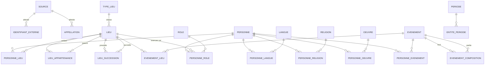

# Coeval — modèle de données

> Écrit le 2026-09-18, à partir de la base Access `MainBdd` (tables Lieu,
> Type de Lieu, Origines, Personnage) fournie en exemple. **Le modèle est
> neutre** : il se pose aussi bien dans Access, SQLite, PostgreSQL ou un
> fichier JSON. Aucun type propre à un moteur n'est utilisé.
>
> Destination : la base finale de Coeval, celle que l'application lira.

## 1. Les cinq règles qui commandent tout le reste

### R1 — Une date est un nombre et une précision, jamais un type « date »

Le type Date des moteurs courants ne descend pas avant l'an 100 et ne sait pas
dire « vers 1450 ». Or l'application accepte des années jusqu'à -300 000, et
Wikidata livre des dates à la décennie ou au siècle.

Partout où une date apparaît, ce sont donc **deux colonnes** :

| Colonne | Contenu |
|---|---|
| `…_annee` | entier signé. `-52` = 52 av. J.-C. Pas d'année zéro : -1 précède 1. |
| `…_precision` | 11 = jour, 10 = mois, 9 = année, 8 = décennie, 7 = siècle, 6 = millénaire |

Les codes sont ceux de Wikidata, repris tels quels pour que l'import n'ait
rien à traduire. Deux colonnes facultatives, `…_mois` et `…_jour`, gardent le
détail quand la précision vaut 10 ou 11.

### R2 — Tout fait porte sa source et sa date de relevé

Pas « Napoléon est né en 1769 », mais « Wikidata, relevé le 18/09/2026, dit que
Napoléon est né en 1769 ». Trois colonnes sur **chaque** table de lien :

| Colonne | Contenu |
|---|---|
| `source_id` | qui l'affirme |
| `releve_le` | quand nous l'avons lu |
| `retenu` | 1 si c'est cette version que l'application affiche |

Sans ces colonnes, brancher une deuxième source est impossible : on ne sait
plus qui a dit quoi, ni lequel des deux est le plus récent.

### R3 — Deux sources qui se contredisent cohabitent, elles ne s'écrasent pas

**Ce n'est pas une hypothèse : c'est mesuré sur ce projet.** Laplace porte deux
dates de mort à un jour d'écart *à l'intérieur de Wikidata seul*. 400 lignes de
réponse ne font que 227 personnes, parce que chacune porte plusieurs valeurs
concurrentes.

Le modèle accepte donc **plusieurs lignes pour le même fait**, une par source.
La colonne `retenu` dit laquelle gagne. **L'arbitrage est du code, pas du
schéma** : la règle actuelle garde la plus précise, puis la plus ancienne à
précision égale.

### R4 — Le pivot entre les sources est la table des identifiants externes

Chaque entité a un numéro **local**, qui n'a de sens que chez nous. Les
identifiants des référentiels (Wikidata `Q517`, VIAF, Pleiades, PeriodO) vivent
dans une table à part, à raison d'autant de lignes que nécessaire.

C'est ce qui permet de dire « notre lieu n° 2 et le `Q142` de Wikidata sont le
même » sans jamais confondre les deux numérotations.

### R5 — Un lien entre deux choses est presque toujours daté

L'Alsace a été française, puis allemande, puis française. Une colonne `Parent`
ne peut pas raconter cela. Presque tous les liens de ce modèle portent donc un
début et une fin, avec leurs précisions.

## 2. Le diagramme

Les tables `IDENTIFIANT_EXTERNE` et `APPELLATION` se rattachent à **n'importe
quelle** entité par un couple (type d'entité, numéro). C'est le seul endroit où
le modèle renonce à une clé étrangère stricte, et c'est assumé : sans cela il
faudrait dupliquer ces deux tables neuf fois.

## 3. Les tables d'entités

Chacune porte au minimum : `id`, `nom` (la forme d'usage en français),
`notice` (une ou deux phrases), `source_id`, `releve_le`.

| Table | Ce qu'elle contient | Colonnes propres |
|---|---|---|
| `personne` | Un être humain | `sexe` (facultatif, pour mesurer le déséquilibre, pas pour l'imposer) |
| `lieu` | Une entité géographique ou politique | `type_lieu_id`, `creation_annee`, `creation_precision`, `fin_annee`, `fin_precision`, `latitude`, `longitude` |
| `type_lieu` | Continent, pays, région, ville, État disparu… | `rang` (pour ordonner du plus large au plus étroit) |
| `evenement` | Ce qui arrive : bataille, traité, révolution, sacre | `type_evenement`, `debut_*`, `fin_*`, `ponctuel` (vrai si un instant) |
| `oeuvre` | Un livre, un tableau, une symphonie, un traité | `type_oeuvre`, `creation_*` |
| `langue` | Une langue | `code_iso` (facultatif) |
| `religion` | Une religion ou un courant | `religion_parent_id` (le luthéranisme sous le christianisme) |
| `role` | Ce qu'on **est** ou ce qu'on **occupe** | `nature` : `metier` (philosophe) ou `fonction` (roi de France) |
| `periode` | Une époque nommée : Renaissance, Néolithique | `debut_*`, `fin_*`, `portee_lieu_id` |

**Pourquoi `role` réunit métier et fonction.** « Philosophe » et « roi de
France » se posent tous deux sur une personne pendant un intervalle. Les
séparer en deux tables obligerait à écrire deux fois chaque requête. La colonne
`nature` suffit à les distinguer — et c'est elle qui dit si la ligne doit
porter un lieu.

## 4. Les tables de lien

Toutes portent : `id`, `debut_annee`, `debut_precision`, `fin_annee`,
`fin_precision`, `source_id`, `releve_le`, `retenu`.

| Table | Relie | Colonne qui précise la nature du lien |
|---|---|---|
| `personne_lieu` | personne ↔ lieu | `nature` : `naissance`, `mort`, `residence`, `sepulture`, `citoyennete` |
| `personne_role` | personne ↔ rôle | `lieu_id` facultatif — « roi **de France** » |
| `personne_langue` | personne ↔ langue | `nature` : `maternelle`, `ecrit`, `parle` |
| `personne_religion` | personne ↔ religion | `nature` : `pratique`, `conversion`, `abjuration` |
| `personne_oeuvre` | personne ↔ œuvre | `nature` : `auteur`, `traducteur`, `commanditaire`, `sujet` |
| `personne_evenement` | personne ↔ événement | `nature` : `participant`, `vainqueur`, `victime`, `signataire` |
| `evenement_lieu` | événement ↔ lieu | `nature` : `deroulement`, `signature` |
| `evenement_composition` | événement ↔ événement | Austerlitz **fait partie de** la guerre de la Troisième Coalition |
| `lieu_appartenance` | lieu ↔ lieu | **Remplace la colonne `Parent`.** Datée : l'Alsace change de parent |
| `lieu_succession` | lieu ↔ lieu | `nature` : `succede`, `scission`, `fusion`, `renommage` |
| `entite_periode` | n'importe quelle entité ↔ période | rattache une vie, une œuvre, un lieu à une époque nommée |

### La naissance et la mort ne sont pas des colonnes de `personne`

Elles sont des lignes de `personne_lieu`, avec `nature = naissance` ou `mort`.

**Trois raisons :**
1. cela dit d'un coup **quand** et **où**, sans dupliquer les colonnes ;
2. deux sources qui se contredisent tiennent côte à côte (règle R3) ;
3. une naissance dont on ignore le lieu s'écrit avec `lieu_id` vide, sans
   rendre la date inutilisable.

**Le prix à payer :** la question la plus courante de l'application — « qui
vivait entre telle et telle année ? » — demande une jointure. On le paie une
fois, avec une **vue** `personne_vie` qui expose `personne_id`,
`naissance_annee`, `naissance_precision`, `mort_annee`, `mort_precision`, en ne
gardant que les lignes `retenu = 1`.

## 5. Les tables transverses

| Table | Colonnes | Rôle |
|---|---|---|
| `source` | `id`, `nom`, `url`, `licence`, `consultee_le` | Wikidata, PeriodO, saisie manuelle… |
| `identifiant_externe` | `id`, `entite_type`, `entite_id`, `referentiel`, `code`, `source_id` | Le pivot entre nos numéros et ceux du monde extérieur |
| `appellation` | `id`, `entite_type`, `entite_id`, `langue_id`, `nom`, `principal`, `source_id` | Les noms selon la langue et la source : « Köln », « Cologne », « Colonia » |

## 6. Ce que devient votre base actuelle

| Aujourd'hui | Devient |
|---|---|
| `Lieu.Parent` | `lieu_appartenance`, datée |
| *(demandé)* « succède » | `lieu_succession`, avec sa nature |
| `Lieu.Date de Création` / `Date de Fin` | conservées, mais en année + précision (règle R1) |
| `Type de Lieu` | conservée, plus une colonne `rang` |
| `Origines` | à trancher — voir § 7 |
| `Personnage.Langues Parlées` | `personne_langue` |
| `Personnage.Lieues de Vie` | `personne_lieu`, `nature = residence` |
| `Personnage.Rôles` | `personne_role` |
| `Personnage.Œuvres` | `personne_oeuvre` |
| `Personnage.Evenements` | `personne_evenement` |
| `Personnage.Religions` | `personne_religion` |
| `Personnage.Date de Naissance` / `de Mort` | `personne_lieu`, `nature = naissance` / `mort` |

Au passage : `Lieues de Vie` s'écrit `Lieux de Vie`.

## 7. Ce que vous seul pouvez trancher

1. **Que veut dire « Origines » ?** Lieu + Personnage sans date ni nature : est-ce
   le lieu de naissance, l'ascendance, la nationalité ? Si c'est la naissance
   ou la citoyenneté, la table disparaît dans `personne_lieu`. Si c'est
   l'ascendance — « d'origine arménienne » —, c'est autre chose et elle reste.
2. **Faut-il une table `personne_personne`** pour la parenté, le maître et
   l'élève, l'alliance ? Le modèle ne la contient pas. Elle est facile à
   ajouter et ouvre beaucoup (les dynasties, les écoles de pensée).
3. **Les œuvres méritent-elles leurs propres liens** vers des lieux et des
   événements, ou suffit-il de passer par leur auteur ?
4. **Jusqu'où descendre dans les types de lieux ?** Continent, pays, région,
   ville — ou aussi quartier, bâtiment ?

## 8. Ce que je n'ai pas fait, et pourquoi

- **Aucune contrainte d'intégrité n'est écrite ici** (clés étrangères, index,
  valeurs obligatoires). Elles dépendent du moteur retenu, et le modèle se veut
  neutre. Elles viendront avec le lot qui crée la base.
- **Aucun volume n'est estimé.** Il dépend du périmètre de sélection, pas du
  modèle. Mesurable dès que la fabrique tourne.
- **Rien n'est mesuré dans ce document.** C'est une proposition de structure,
  pas un constat. Les seuls chiffres cités (Laplace, 400 lignes pour 227
  personnes) viennent des mesures du plan principal, § 3.
